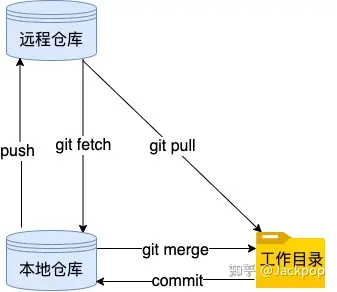
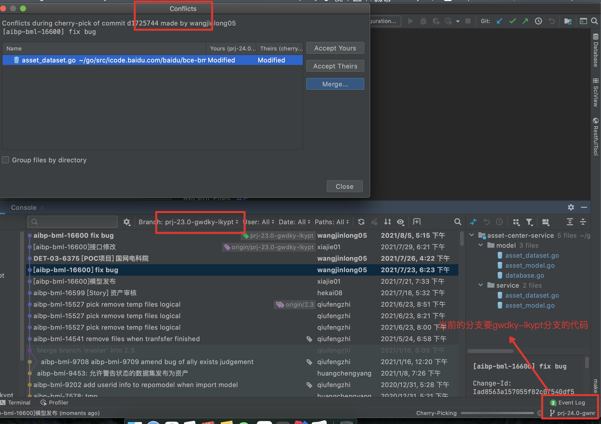

### git

## Git的相关术语





| 工作原理 |                                                              |
| :------- | ------------------------------------------------------------ |
| 1        | **工作区（workspace）**程序员进行开发改动的地方，是你当前看到的，也是最新的。平常我们开发就是拷贝远程仓库中的一个分支，基于该分支进行开发。在开发过程中就是对工作区的操作。 |
| 2        | **暂存区(index)**：.git目录下的index文件, 暂存区会记录 git add 添加文件的相关信息(文件名、大小、timestamp…)，不保存文件实体, 通过id指向每个文件实体。可以使用 git status 查看暂存区的状态。暂存区标记了你当前工作区中，哪些内容是被git管理的。当你完成某个需求或功能后需要提交到远程仓库，那么第一步就是通过 git add 先提交到暂存区，被git管理。 |
| 3        | **本地仓库(repository)：**保存了对象被提交 过的各个版本，比起工作区和暂存区的内容，它要更旧一些。git commit 后同步index的目录树到本地仓库，方便从下一步通过 git push 同步本地仓库与远程仓库的同步。 |
| 4        | **远程仓库(remote)：**远程仓库的内容可能被分布在多个地点的处于协作关系的本地仓库修改，因此它可能与本地仓库同步，也可能不同步，但是它的内容是最旧的。 |

## git常用操作


## git push命令

**git push** 命用于从将本地的分支版本上传到远程并合并。

命令格式如下：

```
git push <远程主机名> <本地分支名>:<远程分支名>
```

如果本地分支名与远程分支名相同，则可以省略冒号：

```
git push <远程主机名> <本地分支名>
```

### 实例

以下命令将本地的 master 分支推送到 origin 主机的 master 分支。

```
$ git push origin master
```

相等于：

```
$ git push origin master:master
```

如果本地版本与远程版本有差异，但又要强制推送可以使用 --force 参数：

```
git push --force origin master
```

删除主机但分支可以使用 --delete 参数，以下命令表示删除 origin 主机的 master 分支：

```
git push origin --delete master
```

### 远程主机管理

```
 git remote -v
```

git 会为该版本库添加一个远程。

```
$ git remote add <short name><remote URL>
```

删除一个远程

```
$ git remote add <short name><remote URL>
```


## git提交

```shell
$ git add .
$ git commit -m "first try"
$ git push origin HEAD:refs/for/master
```

### 一、常规顺序：

```shell
1、git add <文件名>
2、git commit -m "提交说明"
3、git push origin HEAD:refs/for/master
```

### 二、修改后提交

```shell
1、git add a.sh
2、git commit -m "test" DET-03-4315
3、修改
4、重新git add a.sh
5、重新git commit -m "test1"
  使用 git commit --amend  (清楚缓存区，重新提交)
  这时候会进入一个vim界面。告诉你一个change-id，就是对应你上一次git commit的change-id的一个覆盖，
   这里可以重新修改 “test2" 并没有记录
   
   最后一步push
6、git push origin HEAD:refs/for/master

** 注意 这里amend 如果远程push了已经，就不能用了

```

### 三、非常规操作

```shell
1、git add <文件名>
2、git commit -m "提交说明"
3、发生修改
4、重新git add <文件名>
5、重新git commit，实用git commit --amend -m "新的说明"（错误或意外操作，这里不应该加-m "新的说明"，要改说明也应该到弹出的vim中修改）
   如果这么做，存在一个问题就是这一次的commit不是对第一次commit的覆盖，而是对第二次新的commit
6、这时候你可以废弃掉这一次的commit，重新使用git commit --amend，再git push（操作失败）
   如果直接使用git commit --amend，这时候里面的change-id其实是是废弃的那一次的commit-id，但是这一次commit已经废弃，再进行git push时候，会提示这一次commit已经废弃，不允许合入。
7、这时候你已经废弃掉第二次的commit，重新使用git commit --amend，关注这里的change-id（第二次已经废弃的），把它改成第一次commit的change-id，再git push即可
8、git push origin HEAD:refs/for/master
```


## add后取消(撤销添加)

### git reset HEAD

git add 添加 多余文件
有的时候 可能

```shell
git add . （空格+ 点） 表示当前目录所有文件，不小心就会提交其他文件
git add 如果添加了错误的文件的话
```

撤销操作

```shell
git status 先看一下add 中的文件 
git reset HEAD 如果后面什么都不跟的话 就是上一次add 里面的全部撤销了 
git reset HEAD XXX/XXX/XXX.java 就是对某个文件进行撤销了
```


### restore

```
git restore --staged [file] : 表示从暂存区将文件的状态修改成 unstage 状态。当然，也可以不指定确切的文件
```


## commit后取消（撤销提交）


### 1 、 git reset --soft HEAD^ （完全撤销）

修改了本地的代码，然后使用：

```shell
git add file
git commit -m 'test'
```

执行commit后，还没执行push时，想要撤销这次的commit，该怎么办？

解决方案

 使用命令：

```shell
git reset --soft HEAD^
然后使用git log 就看不到之前提交的代码，这样就恢复到原始状态了
```

这样就成功撤销了commit，如果想要连着add也撤销的话，--soft改为--hard（删除工作空间的改动代码）。


命令详解：

> HEAD^  表示上一个版本，即上一次的commit，也可以写成HEAD~1
>  如果进行两次的commit，想要都撤回，可以使用HEAD~2

> --soft
>  不删除工作空间的改动代码 ，撤销commit，不撤销git add file

> --hard
>  删除工作空间的改动代码，撤销commit且撤销add

另外一点，如果commit注释写错了，先要改一下注释，有其他方法也能实现，如：

> git commit --amend
>  这时候会进入vim编辑器，修改完成你要的注释后保存即可。


### 2 、 amend（不需要重新commit）

百度的评审，push 后，修改文件后，重新amend就可以重新push

```shell
 git status 
 1003  git add .
 1004  git commit -m "DET-03-6061 [Task-定制开发] 对接光大镜像仓库"
 1005  git branch 
 1006  git push origin HEAD:refs/for/prj-46.0-gwxc
 1007  修改文件
 1008  git status
 1009  git add .
 1010  git commit --amend
 1011  git push origin HEAD:refs/for/prj-46.0-gwxc

```


有时候我们提交commit完了才发现漏掉了几个文件没有添加，或者提交信息写错了。 此时，可以运行带有 `--amend` 选项的提交命令来重新提交：

```shell
$ git commit --amend
```

这个命令会将暂存区中的文件提交。 如果自上次提交以来你还未做任何修改（例如，在上次提交后马上执行了此命令）， 那么快照会保持不变，而你所修改的只是提交信息。

文本编辑器启动后，可以看到之前的提交信息。 编辑后保存会覆盖原来的提交信息。

例如，你提交后发现忘记了暂存某些需要的修改，可以像下面这样操作：

```console
$ git commit -m 'initial commit'
$ git add forgotten_file
$ git commit --amend
```


## 分支切换

```shell
git branch -a 

wangjinlong05@B000000338059y bdl-console % git branch -a
* master
  remotes/origin/2-7-release
  remotes/origin/2.6
  remotes/origin/2.6.1

```


 1003  git add .
 1004  git status
 1005  git commit -m "guangda-user-manger"
 1006  git push origin HEAD:refs/for/guangda-4.3.2
 1007  git push origin guangda-4.3.2
 1008  git push origin HEAD:refs/for/guangda-4.3.2
 1009  git status 
 1010  git log 
 1011  git reset --soft HEAD^
 1012  git log 
 1013  git add .
 1014  git status
 1015  git commit -m "[DET-03-4315] add  deleteiamuserAndNotebook "
 1016  git push origin HEAD:refs/for/guangda-4.3.2


## diff查看更改

```shell
git diff go.mod
```


## cherry-pick（摘樱桃）

比如现在想要把 prj-23.0-gwdky-lkypt 的上面的几个功能摘到prj-24.0-gwnr这个新分支上。

先切换到prj-24.0-gwnr 分支上，然后选择那个分支进行cherry-pick





直接右键 cherry-pick一下 到当前分支就可以，如果有冲突，会提示解决冲突的


git cherry-pick可以选择某一个分支中的一个或几个commit(s)来进行操作。

例如，假设

我们有个稳定版本的分支，叫v2.0，

另外还有个开发版本的分支v3.0，

我们不能直接把两个分支合并，

这样会导致稳定版本混乱，但是又想增加一个v3.0中的功能到v2.0中，这里就可以使用cherry-pick了,其实也就是对已经存在的commit 进行再次提交.

```
git cherry-pick <commit id>:单独合并一个提交


git cherry-pick -x <commit id>：同上，不同点：保留原提交者信息。
git cherry-pick <start-commit-id>..<end-commit-id>


git cherry-pick <start-commit-id>^..<end-commit-id>
```

前者表示把到之间(左开右闭，不包含start-commit-id)的提交cherry-pick到当前分支； 
后者有”^”标志的表示把到之间(闭区间，包含start-commit-id)的提交cherry-pick到当前分支。

## git 多个commit合并成一个commit


```shell
 1025  git rebase -i  fbd8e008694d0f3efe92e452269861b49d1c41de
 1026  git status
 1027  git log
 1028  git push origin HEAD:refs/for/prj-47.0-gwnr
 1029  git commit --amend

比如我们刚提交了A B 俩个commit.
比如git log  命令查看有 ZZZ A B  三个commit,但是我们想合并B的提交到A里面然后一起提交

首先要rebase ZZZ  这个 commit 的id 。然后才可以把B合并到A里面。
执行完 git rebase -i后，自动进入vim 模式
需要把B的pick 改为 squash，然后保存，之后会继续跳转到commit message 的编辑界面。
然后再保存，再push 就可以了
```


## merge

A、B 俩个分支，

比如要把A上比B多的代码，merge到B分支上

首先在idea中切换到B分支上，然后选中A分支，点击merge，然后处理冲突。这样就merge成功了。


一、开发分支（dev）上的代码达到上线的标准后，要合并到 master 分支

```
git checkout dev
git pull
git checkout master
git merge dev
git push -u origin master
```

二、当master代码改动了，需要更新开发分支（dev）上的代码

```
git checkout master 
git pull 
git checkout dev
git merge master 
git push -u origin dev
```

## 


## Git删除无效远程分支

当远程分支删除的时候，本地同步下来的远程分支却不会删除，久而久之，本地积累了不少无效的远程分支。找了一下，可以用如下命令清除它们：

**git remote update -p**